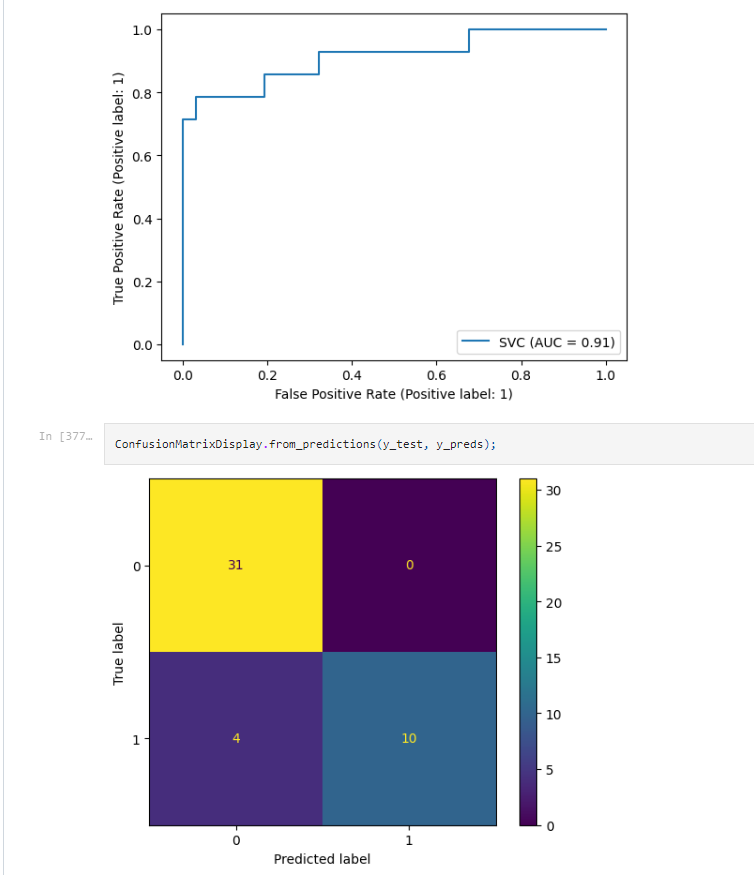

## Titanic Survival Predictions

### Jupyter Notebook DEMO

- [Titanic Survival Predictions](https://github.com/andrewtclin/ml-titanic-survival-prediction/blob/master/competition_titanic.ipynb)

### Overview

- This project focuses on the Titanic dataset and aims to predict whether a person can survive on the Titanic using a machine learning model.
- The trained model provides accurate predictions and helps gain insights into the factors affecting survival.

### Features

- Utilizes the Titanic dataset for training and prediction.
- Builds a machine learning model to predict survival on the Titanic.
- Provides insights into the factors influencing survival rates.
- Achieves high accuracy in predicting survival outcomes.
